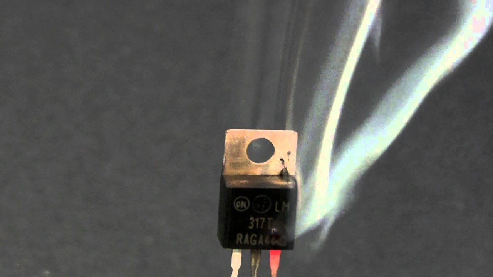

<div align="center">
    
  </a>
<h3 align="center">Electrical Engineer Students Toolkit</h3>
<h4 aling="center">Tools, scripts and everything that helps.</h4>
  <p align="center">
    <br />
  </p>
</div>

## About this Repository

A single place where we can store all of the smart stuff we individually create, to help each other.

<div align="center">
    
</div>

## Repository Structure

An example of the repository structure is shown below.

```
x   LICENSE
¦   README.md
+---7-semester
    +---deep-learning
    ¦       andreas-nn_generator.py
    ¦       david-image_generator.py
    ¦       
    +---electronic-hardware-system-design
```

The repository is divided into semester, which are then divided into subfolders for each course. All files relevant to a course should be in this folder. Please name your file as `yourname-your_file_name.extension`.

## Branches

Branch names should be lower case and use hyphens `-` as space between words e.g.

```
yourname/branch-name
```


## Merging

If you want to add something:

- Create a branch.
- Commit your stuff.
- Create a pull request.

Pull requests require **at least** one approval from a peer. We only do squash merging. It is recommended to keep the pull request number (#00) in the commit title when squashing the pull request. Keep in mind:

- No merge commits.
- Only fast forward merging.
